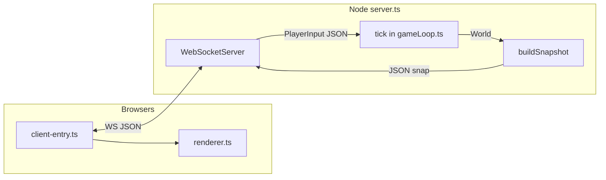

# turboWorms — Developer Guide

This document is for **new contributors**: how the game is structured, how data flows, how to run and test it, and a **worked example** for improving fireball visibility.

---

## Table of contents

1. [What this project is](#1-what-this-project-is)
2. [Tech stack & prerequisites](#2-tech-stack--prerequisites)
3. [Repository map](#3-repository-map)
4. [High-level architecture](#4-high-level-architecture)
5. [Authoritative simulation model](#5-authoritative-simulation-model)
6. [The tick pipeline (single source of truth)](#6-the-tick-pipeline-single-source-of-truth)
7. [Module reference](#7-module-reference)
8. [Networking & snapshots](#8-networking--snapshots)
9. [Client & rendering](#9-client--rendering)
10. [How to run, build, and test](#10-how-to-run-build-and-test)
11. [Development practices](#11-development-practices)
12. [Worked example: a more visible fireball](#12-worked-example-a-more-visible-fireball)
13. [Further reading](#13-further-reading)

---

## 1. What this project is

**turboWorms** is a **multiplayer snake-like arena** with:

- **Authoritative server** — all simulation runs on Node; clients send **intent** only.
- **Deterministic-ish sim** — fixed timestep, ordered subsystems, explicit world state (`World`).
- **Canvas client** — receives JSON snapshots, interpolates between frames, draws snakes, food, fireballs.

There is **no separate game engine**; logic lives in plain TypeScript modules orchestrated by `gameLoop.ts` and driven by `server.ts`.

---

## 2. Tech stack & prerequisites

| Piece | Choice |
|--------|--------|
| Language | TypeScript (`.ts`), Node **ES modules** (`"type": "module"` in `package.json`) |
| Server runtime | Node **20+** with `--experimental-strip-types` (no separate `tsc` step for server) |
| WebSocket | `ws` |
| Browser bundle | `esbuild` → `public/client.bundle.js` |

**Install & run**

```bash
npm install
npm start
```

- HTTP + static files: `http://localhost:8765/` (default `PORT`)
- WebSocket: `ws://localhost:8765/`
- `prestart` runs `build:client` so the Canvas bundle exists.

**Useful env vars**

| Variable | Meaning |
|----------|---------|
| `PORT` | HTTP / WS listen port (default `8765`) |
| `TICK_HZ` | Sim rate, clamped **20–30** (default `25`) |
| `MAX_FOOD_IN_SNAPSHOT` | Max food orbs per JSON snap; `≤0` sends **all** |
| `MAX_FOOD_IN_SNAPSHOT` (with positive cap) | Uses **proximity to heads** when trimming (see `server.ts`) |

---

## 3. Repository map

```
contracts/          # Types only — World, Snake, input, food shapes
  input.ts          # PlayerInput (client → server)
  snake.ts          # Snake geometry + state flags
  world.ts          # World, FoodOrb, Fireball, SpawnField, bounds

movement.ts         # Head + rope body, steering rate limit
food.ts             # Spawn fields, Brownian drift, vacuum pull, tickFood
abilities.ts        # tickAbilities — fireball spawn, shield/boost/turbo costs
collision.ts        # Grid-based collisions, food pickup, death drops
gameLoop.ts         # tick(world, inputs, dt) — strict subsystem order
server.ts           # HTTP static + WS, sessions, buildSnapshot, broadcast
renderer.ts         # Canvas GameRenderer + parseGameSnapshot (browser)
public/
  index.html        # HUD + canvas
  client-entry.ts   # WS + input loop + GameRenderer wiring
  client.bundle.js  # Built artifact (gitignored)

tests/              # node:test, run with --experimental-strip-types
docs/               # Design / tech notes + this guide
plans/              # Execution specs (integration, collision, food, …)
```

**Intentional split**

- **`contracts/`** — shared shapes; keep **free of runtime logic** where possible.
- **Systems** (`movement`, `food`, `abilities`, `collision`) — **pure functions** over data; no hidden globals.
- **`gameLoop.ts`** — **only place** that defines **tick order** and glues systems to `World`.

---

## 4. High-level architecture



1. Each client opens a WebSocket and receives **`{ t: "welcome", id, tickHz, bounds }`**.
2. Clients send **`{ t: "input", d: PlayerInput }`** at a fixed cadence (~45 Hz in `client-entry.ts`); server merges into per-tick `TickInputs`.
3. Server runs **`tick(world, inputs, dt)`** at **`TICK_HZ`**.
4. After each tick, server **`broadcast({ t: "snap", ...buildSnapshot(world) })`**.
5. Client **`parseGameSnapshot`** → **`GameRenderer.pushSnapshot`** → RAF draw loop.

**Rule of thumb:** If it changes **who wins**, **positions**, or **resources**, it belongs on the **server / tick**. If it only changes **how things look**, it can stay in **`renderer.ts`** (or CSS/HTML).

---

## 5. Authoritative simulation model

Everything mutable hangs off **`World`** (`contracts/world.ts`):

| Field | Role |
|-------|------|
| `bounds` | Circular arena metadata (used for field placement) |
| `spawnFields` | Static food regions |
| `snakes[]` | Worms: segments polyline, `direction` (radians), `speed` (intrinsic scalar), `alive`, `mass` mirror, `state` |
| `food[]` | Drifting orbs |
| `fireballs[]` | Projectiles (same shape as ability `FireballProjectile`) |
| `snakeMassById` | **Authoritative** mass map (used for growth, abilities, UI mass) |
| `foodRng`, `foodNextOrbId`, `foodSpawnAccumSec` | Food subsystem counters |
| `nextFireballId`, `nextFoodSpawnId` | Id allocators |
| `tick` | Monotonic frame index |

**Mass vs segments**

- **`snakeMassById`** is the source of truth for resource pool.
- **`applyMassLengthSync`** in `gameLoop.ts` adjusts **segment count** from mass (`MASS_PER_SEGMENT`).

**Player intent** (`contracts/input.ts`)

- `direction: Vec2` — unit-ish; server converts to **`atan2`** radians for `Snake.direction`.
- `fire`, `shield`, `boost`, `turbo` — booleans; server maps to `AbilityInput` (`fireballTriggered`, `shieldHeld`, …).

---

## 6. The tick pipeline (single source of truth)

Implemented in **`tick()`** in `gameLoop.ts`. Order matters for determinism and gameplay feel.

| Step | What runs |
|------|-----------|
| 1 | **`applyInputs`** — merge facing; **`steerHeadingToward`** caps turn rate (WASD / net snap) |
| 2 | **`updateAbilityHeldState`** — e.g. `state.shield` from held shield |
| 3 | **`simulateMovement`** — head + rope; boost/turbo **preview** multiplies speed **without** persisting boosted speed on the snake |
| 4 | **`tickAbilities`** per snake — fireball spawn, drains; updates mass; appends `fireballsSpawned` |
| 4b | **`integrateFireballs`** — linear motion for the tick |
| 5 | **`resolveCollisions`** — fireball vs snakes, head vs head, head vs **enemy** body, head vs food, deaths → corpse orbs |
| 6 | **`tickFood`** with **`consumeWithHeads: false`** — Brownian + spawns + **head vacuum**; eating already handled in collision |
| 7 | **`applyMassLengthSync`** — grow/shrink segments to match mass |

**Why food consumption is “false” in `tickFood`**

- Collision already applies **head vs food** and **`massGained`**. Running head consume again in food would **double-count**.

---

## 7. Module reference

### `movement.ts`

- **`simulateMovement`** — moves head along `(cos dir, sin dir) * speed * dt`, reclothes body at `SEGMENT_SPACING`.
- **`steerHeadingToward`** — limits radians per second toward target facing.

### `abilities.ts`

- **`tickAbilities(snake + mass, AbilityInput, dt, ctx)`**  
  - Fireball: if `fireballTriggered`, spawns projectile from **head**, direction = `snake.direction`, speed = `ctx.flatProjectileSpeed`, radius from **`headRadiusFromMass`**, costs **10%** mass (`FIREBALL_MASS_FRACTION`).
  - Shield / turbo / boost drains and speed multipliers (movement uses parallel gates in `gameLoop` for boost preview).

### `collision.ts`

- **`resolveCollisions(snakes, fireballs, foods, options?)`**  
  Uniform **grid** over snake segments + circle tests.
- **Self body** does **not** kill the owner (intentional design); **enemy** body still kills attacker head.
- **Food**: head overlap → `massGained`, orb removed from list passed through.

### `food.ts`

- **`generateSpawnFields`**, **`tickFood`** — spawns in fields, Brownian, **`applyHeadVacuumPull`** near heads, optional head consume when enabled.
- Deterministic RNG: **`random01`** (xorshift32).

### `gameLoop.ts`

- **`tick`**, **`createEmptyWorld`**, **`applyMassLengthSync`**, **`MASS_PER_SEGMENT`**, **`IDLE_ABILITIES`**.

### `server.ts`

- **`startServer`** — HTTP static from `public/`, WebSocket sessions, **`buildTickInputs`**, **`mergePlayerInput`**, **`buildSnapshot`**, **`selectFoodForSnapshot`** (proximity-aware cap).
- Clears **`fire`** after each sim tick (edge re-fire requires client to keep sending `true` when desired — see server loop).

### `renderer.ts`

- **`parseGameSnapshot`** — tolerates `{ t: "snap", ... }` wire shape.
- **`GameRenderer`** — linear interpolation between last two snaps; camera follows `followPlayerId`; draws food, fireballs, snakes.

### `public/client-entry.ts`

- WebSocket URL from host or `?ws=...`.
- Input loop: WASD → `direction`, keys for abilities.
- **`?debugFood=1`** — extra food debug overlay (see `GameRendererOptions` in `renderer.ts`).

---

## 8. Networking & snapshots

**Welcome** (first message to a client)

```json
{ "t": "welcome", "id": "p-1", "tickHz": 25, "bounds": { ... } }
```

**Snap** (every sim tick, broadcast)

```json
{
  "t": "snap",
  "tick": 123,
  "snakes": [ { "id", "alive", "head", "dir", "length", "mass", "visibleSegments" } ],
  "food": [ { "id", "x", "y", "r" } ],
  "foodTotal": 1234,
  "fireballs": [ { "id", "ownerId", "x", "y", "r" } ]
}
```

- **`foodTotal`** may exceed `food.length` when the server caps food on the wire; nearby orbs are prioritized.

**Client → server input**

```json
{
  "t": "input",
  "d": {
    "direction": { "x": 1, "y": 0 },
    "fire": false,
    "shield": false,
    "boost": false,
    "turbo": false
  }
}
```

---

## 9. Client & rendering

1. **`npm start`** serves `public/index.html` and `client.bundle.js`.
2. **`GameRenderer.start()`** runs `requestAnimationFrame` loop.
3. **`pushSnapshot`** updates `prev` / `curr` and EWMA timing for interpolation **`alpha`**.
4. World draw uses **camera transform**: scale + translate so followed snake head stays near canvas center.

**Interpolation**

- Snakes / food / fireballs lerp between **`prev`** and **`curr`** for smooth motion between network ticks.

---

## 10. How to run, build, and test

```bash
# Install
npm install

# Run server + build client (prestart)
npm start

# Rebuild client only (after editing renderer / client-entry)
npm run build:client
```

**Tests** (from repo root)

```bash
node --experimental-strip-types --test tests/*.test.ts
```

Patterns:

- **`tests/<system>.test.ts`** — unit tests for one module.
- **`tests/integration.test.ts`** — multi-system via `tick()`.
- **`tests/snapshot.food.test.ts`** — server snapshot selection.

When adding behavior, **add or extend a test** near the module you touched.

---

## 11. Development practices

1. **Respect tick order** — if you need a new global pass, justify where it lives in `tick()` vs inside a subsystem.
2. **Keep `World` serializable** — avoid class instances with methods on world state.
3. **Determinism** — sort entities by **`id`** when iteration order affects outcome (see food, collision, gameLoop sorts).
4. **Don’t duplicate rules** — e.g. boost eligibility is mirrored for movement preview and `tickAbilities`; if you change one, update the other or extract a shared helper.
5. **Client is dumb** — never trust client for mass, hits, or spawns; only for **intent**.

---

## 12. Worked example: a more visible fireball

Fireballs already exist end-to-end: **abilities spawn → world.fireballs → integrate → collision → snapshot → renderer**. This example walks **where each piece lives** and how to **make them pop visually** without breaking authority.

### Step A — Trace the data path (read-only mental model)

1. **Input** — Client sends `d.fire: true` (`public/client-entry.ts`). Server maps to `fireballTriggered` (`server.ts` → `buildTickInputs`).
2. **Simulation** — `gameLoop.ts` calls **`tickAbilities`** with `fireballTriggered`. **`abilities.ts`** pushes a `FireballProjectile` with `id`, `ownerId`, `position` (head), `velocity` along `cos/sin(direction) * flatProjectileSpeed`, `radius` from mass.
3. **World** — `gameLoop` copies spawns into **`world.fireballs`** and advances positions in **`integrateFireballs`**.
4. **Collision** — **`collision.ts`** may remove fireballs (body hit) or kill snakes (head hit).
5. **Wire** — **`buildSnapshot`** in `server.ts` maps each fireball to `{ id, ownerId, x, y, r }` (rounded).
6. **Client** — **`parseGameSnapshot`** → **`GameRenderer`** draws with **`drawFireball`** in `renderer.ts`.

If something “doesn’t show”, check **(5)** snapshot first, then **(6)** draw order / alpha.

### Step B — Cosmetic-only change (fastest): improve `drawFireball`

**Files:** `renderer.ts` only. Rebuild client: `npm run build:client`.

Ideas:

- Increase glow radius / add a second **outer ring** stroke using `ownerId` hash for color.
- Draw a **motion streak** from interpolated previous position (store last draw position on `GameRenderer` per `fb.id` — **visual-only cache**, not sim state).
- Raise draw order: in `renderFrame`, move the fireball loop **after** food but **before** snakes so worms draw on top.

**Risk:** none for gameplay; snapshot schema unchanged.

### Step C — Snapshot-visible metadata (semi-cosmetic)

If you want the client to draw **different styles for own vs enemy** fireballs without guessing:

1. Extend **`buildSnapshot`** in `server.ts` to add e.g. **`isMine`** only for the recipient — that requires **per-connection snapshots** (today broadcast is shared). Bigger change.
2. Simpler: client already knows **`welcome.id`**; in `GameRenderer`, compare `fb.ownerId === followPlayerId` when drawing (already have `followPlayerId` in options).

**Files:** `renderer.ts`, optionally `public/client-entry.ts` if you pass a flag into `GameRenderer`.

### Step D — Gameplay-visible fireball (bigger radius / trail in sim)

If “visible” means **larger hitbox / longer range**:

1. **`abilities.ts`** — change spawn `radius` formula or `ctx.flatProjectileSpeed` source (`gameLoop.ts` `DEFAULT_FLAT_PROJECTILE_SPEED` or `GameTickOptions.flatProjectileSpeed`).
2. **`collision.ts`** — uses projectile `radius` from world; no change if radius already flows through.
3. **Tests** — update **`tests/abilities.test.ts`**, **`tests/collision.test.ts`**, any integration tests expecting numeric positions.

**Rule:** anything that affects **hits or damage** must stay **server-side** and be **tested**.

### Step E — Brand-new “client-only ghost” fireball (not recommended)

You could draw a fake fireball from predicted input without server confirmation. **Avoid** — it will **desync** from authoritative snaps. Prefer server-driven `fireballs` array.

### Checklist for your MR

- [ ] If sim changed: new/updated **`tests/*.test.ts`**
- [ ] If wire shape changed: update **`parseGameSnapshot`** + **`GameSnapshot` types** in `renderer.ts`
- [ ] Run **`npm run build:client`** if `renderer.ts` or `client-entry.ts` changed
- [ ] Run **`node --experimental-strip-types --test tests/*.test.ts`**

---

## 13. Further reading

| Doc | Contents |
|-----|----------|
| `docs/PRODUCT.md` | Current gameplay rules/numbers — source of truth |
| `docs/ARCHITECTURE.md` | Current module map, data flow, tick order — source of truth |
| `docs/archive/game_design.md` | Superseded early gameplay intent (history only) |
| `docs/archive/tech_spec.md` | Superseded early technical notes (history only) |
| `plans/archive/integration.exec.md` | Superseded tick order rationale (history only) |
| `plans/archive/networking.exec.md` | Superseded network / snapshot ideas (history only) |
| `plans/archive/collisions.exec.md` | Superseded collision design (history only) |
| `plans/archive/food.exec.md` | Superseded food fields / spawn design (history only) |

---

*Last updated to match the repository layout and modules as of this guide’s authoring. When in doubt, start from **`gameLoop.ts` → `tick()`** and follow imports outward.*
